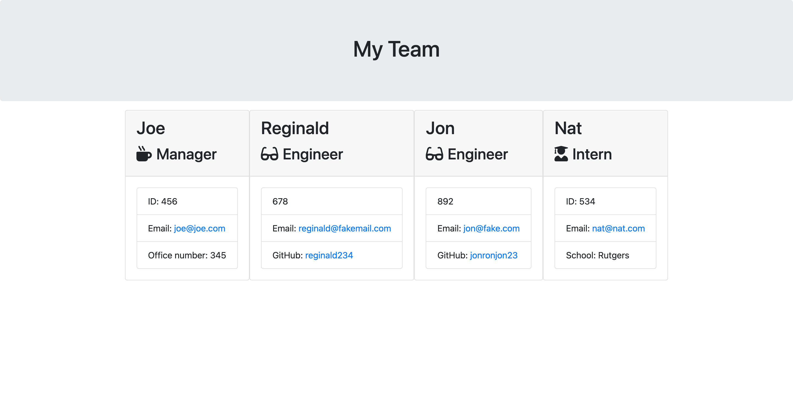

# Team-Profile-Generator
  
  
  ## Description 
  The goal of this project is to have users be able to generate a team profile html page. First we create a parent class called Employees. There will be a couple of different methods that the children classes will use such as getName(), getId(), getEmail(). Each of the subclasses (manager, intern, engineer). In addition to using the aforementioned methods in the employee parent class, each subclass will have a unique method to their class (for example only the intern class will use the getSchool method.) The getRole method will be overwritten in each of the subclasses so that each instatiation of the getRole method in each of the subclasses will not return 'Employee" but rather their specific roles. The user will be prompted several questions using the inquirer module. After the answers have been submitted an html file will be generated in a folder called output.

  ## Table of Contents
  * [Installation](#installation)
  * [Usage](#usage)
  * [Contributing](#contributing)
  * [Tests](#tests)
  * [License](#license)
  * [Bugs](#bugs)
  * [Questions](#questions)
  * [Media](#media)

  
  ## Installation 
  The user must first install node. After that the user will also install the inquirer module. Without the inquirer module, the program will not be able to prompt the user with questions. The user must also 
  ## Usage 
  You will need to run npm init -y and npm i inquirer and jest. Jest is necessary for running the tests. 
  ## Contributing 
  They can add more conditional statements to check for invalid responses. Nathaniel Epstein.
  ## Tests
  npm test (for the test.js suites)
  ## License 
  This project is license under MIT License
  ## Bugs
  N/A

  ## Questions
  If you have any questions about this projects, please contact me directly at nathaniel.epstein@gmail.com. You can view more of my projects at https://github.com/natpitt2393.

  ## Media
  
  
  [napitt2393/Team-Profile-Generator](https://github.com/natpitt2393/Team-Profile-Generator)